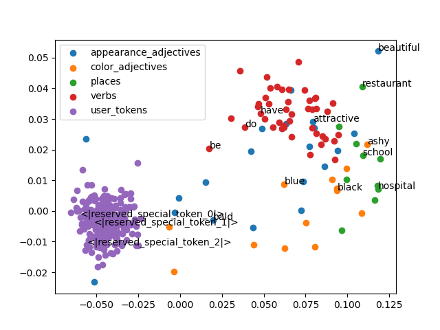
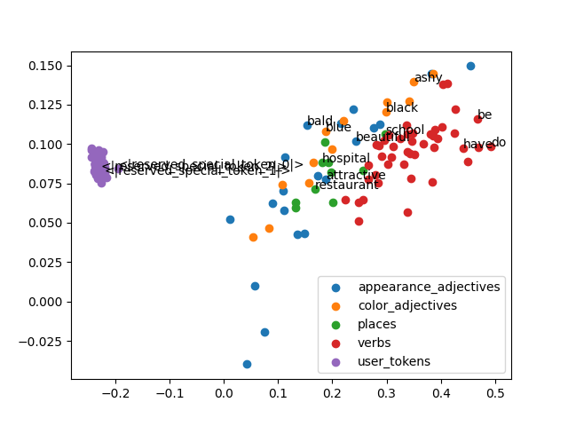

Loading embeddings ...
Running pca ...
# Using Input Embeddings

#### King-Queen test on raw Input Embeddings
* Other distances `[32.51428985595703, 37.409427642822266, 39.08250045776367, 38.79890441894531, 39.866519927978516, 29.18087387084961]`
* king + female - male - queen `43.32189178466797`
#### King-Queen test on PCA n_components=2 of Input Embeddings
* Other distances `[0.027252002276688767, 0.027137036493371142, 0.04395337603077948, 0.02595674238323897, 0.0466012246742316, 0.020644482290992625]`
* king + female - male - queen `0.03510679257542915`

## Checking similarity of similar words
#### With full Input Embeddings:
* Internal similarity of appearance_adjectives: `{'1-norm': 45.82983655427632, '2-norm': 0.8111406828227796}`
* Internal similarity of color_adjectives: `{'1-norm': 39.518482697315704, '2-norm': 0.6089321038661859}`
* Internal similarity of places: `{'1-norm': 37.08209364149305, '2-norm': 0.5266088273790147}`
* Internal similarity of verbs: `{'1-norm': 32.83524585425476, '2-norm': 0.413026386285181}`
* Internal similarity of user_tokens: `{'1-norm': 15.602964827405858, '2-norm': 0.09606382830206155}`
#### With PCA Input Embeddings n_components=2:
* Internal similarity of appearance_adjectives: `{'1-norm': 0.07371675831084608, '2-norm': 0.005227710051805798}`
* Internal similarity of color_adjectives: `{'1-norm': 0.05709373169199297, '2-norm': 0.0032734667917885684}`
* Internal similarity of places: `{'1-norm': 0.026682569956236406, '2-norm': 0.0005282231944498839}`
* Internal similarity of verbs: `{'1-norm': 0.028649763368479342, '2-norm': 0.0007439695231279749}`
* Internal similarity of user_tokens: `{'1-norm': 0.015583691118492764, '2-norm': 0.00020161160759448206}`
## Checking similarity between word categories
#### With full Input Embeddings:
* Between appearance_adjectives and color_adjectives: `{'1-norm': 44.026431039663464, '2-norm': 0.7485586313100961}`
* Between appearance_adjectives and places: `{'1-norm': 43.026572265625, '2-norm': 0.7122566223144531}`
* Between appearance_adjectives and verbs: `{'1-norm': 40.96349875710227, '2-norm': 0.6469200134277344}`
* Between appearance_adjectives and user_tokens: `{'1-norm': 35.479443359375, '2-norm': 0.48519449869791664}`
* Between color_adjectives and appearance_adjectives: `{'1-norm': 44.026438551682695, '2-norm': 0.748558572622446}`
* Between color_adjectives and places: `{'1-norm': 40.08475435697115, '2-norm': 0.6193116995004507}`
* Between color_adjectives and verbs: `{'1-norm': 38.27623060533217, '2-norm': 0.5642750346577251}`
* Between color_adjectives and user_tokens: `{'1-norm': 32.33633814102564, '2-norm': 0.40434969388521635}`
* Between places and appearance_adjectives: `{'1-norm': 43.026572265625, '2-norm': 0.7122564697265625}`
* Between places and color_adjectives: `{'1-norm': 40.08475060096154, '2-norm': 0.6193115821251503}`
* Between places and verbs: `{'1-norm': 36.64805575284091, '2-norm': 0.5140884052623402}`
* Between places and user_tokens: `{'1-norm': 30.704189453125, '2-norm': 0.3599194081624349}`
* Between verbs and appearance_adjectives: `{'1-norm': 40.963520951704545, '2-norm': 0.6469200134277344}`
* Between verbs and color_adjectives: `{'1-norm': 38.27621694711539, '2-norm': 0.5642751413625438}`
* Between verbs and places: `{'1-norm': 36.64805797230114, '2-norm': 0.514088301225142}`
* Between verbs and user_tokens: `{'1-norm': 27.5556640625, '2-norm': 0.29038275516394413}`
* Between user_tokens and appearance_adjectives: `{'1-norm': 35.479427083333334, '2-norm': 0.4851953633626302}`
* Between user_tokens and color_adjectives: `{'1-norm': 32.3363030849359, '2-norm': 0.4043491461338141}`
* Between user_tokens and places: `{'1-norm': 30.704195963541668, '2-norm': 0.3599193572998047}`
* Between user_tokens and verbs: `{'1-norm': 27.5556640625, '2-norm': 0.2903825008507931}`
#### With PCA Input Embeddings n_components=2:
* Between appearance_adjectives and color_adjectives: `{'1-norm': 0.07027773061938535, '2-norm': 0.004699739774001662}`
* Between appearance_adjectives and places: `{'1-norm': 0.07806886897940137, '2-norm': 0.006319326815660639}`
* Between appearance_adjectives and verbs: `{'1-norm': 0.05905342359931922, '2-norm': 0.003398828450334957}`
* Between appearance_adjectives and user_tokens: `{'1-norm': 0.11725594115296455, '2-norm': 0.011686865148228481}`
* Between color_adjectives and appearance_adjectives: `{'1-norm': 0.07027773061938535, '2-norm': 0.004699739774001662}`
* Between color_adjectives and places: `{'1-norm': 0.058155257578507966, '2-norm': 0.0034393564505948043}`
* Between color_adjectives and verbs: `{'1-norm': 0.06456470253796076, '2-norm': 0.002872607265670615}`
* Between color_adjectives and user_tokens: `{'1-norm': 0.12606084006755885, '2-norm': 0.014843277981170447}`
* Between places and appearance_adjectives: `{'1-norm': 0.07806886897940137, '2-norm': 0.006319326815660637}`
* Between places and color_adjectives: `{'1-norm': 0.058155257578507966, '2-norm': 0.0034393564505948043}`
* Between places and verbs: `{'1-norm': 0.0615009280467142, '2-norm': 0.0026926629526352335}`
* Between places and user_tokens: `{'1-norm': 0.17239764930908547, '2-norm': 0.024210741187911645}`
* Between verbs and appearance_adjectives: `{'1-norm': 0.05905342359931921, '2-norm': 0.0033988284503349564}`
* Between verbs and color_adjectives: `{'1-norm': 0.06456470253796076, '2-norm': 0.002872607265670615}`
* Between verbs and places: `{'1-norm': 0.061500928046714205, '2-norm': 0.0026926629526352335}`
* Between verbs and user_tokens: `{'1-norm': 0.1458030523310111, '2-norm': 0.013984029442493228}`
* Between user_tokens and appearance_adjectives: `{'1-norm': 0.11725594115296455, '2-norm': 0.01168686514822848}`
* Between user_tokens and color_adjectives: `{'1-norm': 0.12606084006755883, '2-norm': 0.014843277981170447}`
* Between user_tokens and places: `{'1-norm': 0.1723976493090855, '2-norm': 0.024210741187911645}`
* Between user_tokens and verbs: `{'1-norm': 0.1458030523310111, '2-norm': 0.013984029442493228}`

Running pca ...
# Using Output Embeddings

#### King-Queen test on raw Output Embeddings
* Other distances `[44.75288391113281, 60.99585723876953, 59.32288360595703, 60.202598571777344, 55.90953063964844, 36.414268493652344]`
* king + female - male - queen `54.98725128173828`
#### King-Queen test on PCA n_components=2 of Output Embeddings
* Other distances `[0.11270446132310348, 0.045399751544004996, 0.005447859907649247, 0.15810421286710846, 0.11815232123075273, 0.03995189163635575]`
* king + female - male - queen `0.07275256968674775`

## Checking similarity of similar words
#### With full Output Embeddings:
* Internal similarity of appearance_adjectives: `{'1-norm': 55.95501130756579, '2-norm': 1.2188006752415708}`
* Internal similarity of color_adjectives: `{'1-norm': 53.13306916065705, '2-norm': 1.0966617877666767}`
* Internal similarity of places: `{'1-norm': 54.300282118055556, '2-norm': 1.1475796169704862}`
* Internal similarity of verbs: `{'1-norm': 51.088617369186046, '2-norm': 1.0213480459459237}`
* Internal similarity of user_tokens: `{'1-norm': 11.389379576359833, '2-norm': 0.059839807826937326}`
#### With PCA Output Embeddings n_components=2:
* Internal similarity of appearance_adjectives: `{'1-norm': 0.18593830278877044, '2-norm': 0.031021982546824596}`
* Internal similarity of color_adjectives: `{'1-norm': 0.16762545501696785, '2-norm': 0.025528469917787663}`
* Internal similarity of places: `{'1-norm': 0.07674034794986391, '2-norm': 0.005675457044339345}`
* Internal similarity of verbs: `{'1-norm': 0.09692816642195415, '2-norm': 0.009482534619700896}`
* Internal similarity of user_tokens: `{'1-norm': 0.009456744504766145, '2-norm': 7.840695330591497e-05}`
## Checking similarity between word categories
#### With full Output Embeddings:
* Between appearance_adjectives and color_adjectives: `{'1-norm': 57.14406926081731, '2-norm': 1.2598889864408054}`
* Between appearance_adjectives and places: `{'1-norm': 57.9766259765625, '2-norm': 1.293535919189453}`
* Between appearance_adjectives and verbs: `{'1-norm': 56.701478160511364, '2-norm': 1.244136602228338}`
* Between appearance_adjectives and user_tokens: `{'1-norm': 47.30353515625, '2-norm': 0.9325424194335937}`
* Between color_adjectives and appearance_adjectives: `{'1-norm': 57.14406926081731, '2-norm': 1.2598889864408054}`
* Between color_adjectives and places: `{'1-norm': 57.10926607572115, '2-norm': 1.2589123065655048}`
* Between color_adjectives and verbs: `{'1-norm': 56.31180684549825, '2-norm': 1.2198496998606863}`
* Between color_adjectives and user_tokens: `{'1-norm': 47.81021133814102, '2-norm': 0.9537797976762821}`
* Between places and appearance_adjectives: `{'1-norm': 57.976611328125, '2-norm': 1.2935360717773436}`
* Between places and color_adjectives: `{'1-norm': 57.10928109975961, '2-norm': 1.2589125413161057}`
* Between places and verbs: `{'1-norm': 56.765793678977275, '2-norm': 1.240390292080966}`
* Between places and user_tokens: `{'1-norm': 48.165185546875, '2-norm': 0.9526836140950521}`
* Between verbs and appearance_adjectives: `{'1-norm': 56.70144708806818, '2-norm': 1.2441370183771308}`
* Between verbs and color_adjectives: `{'1-norm': 56.31183074737762, '2-norm': 1.2198495931558675}`
* Between verbs and places: `{'1-norm': 56.76578480113636, '2-norm': 1.2403908469460228}`
* Between verbs and user_tokens: `{'1-norm': 48.32470703125, '2-norm': 1.0169164484197444}`
* Between user_tokens and appearance_adjectives: `{'1-norm': 47.303603515625, '2-norm': 0.932542724609375}`
* Between user_tokens and color_adjectives: `{'1-norm': 47.810216346153844, '2-norm': 0.9537799541766827}`
* Between user_tokens and places: `{'1-norm': 48.165146484375, '2-norm': 0.9526848347981771}`
* Between user_tokens and verbs: `{'1-norm': 48.32463008996212, '2-norm': 1.0169174656723485}`
#### With PCA Output Embeddings n_components=2:
* Between appearance_adjectives and color_adjectives: `{'1-norm': 0.17882418745280865, '2-norm': 0.02908945013256196}`
* Between appearance_adjectives and places: `{'1-norm': 0.1399509216096578, '2-norm': 0.017692872240338248}`
* Between appearance_adjectives and verbs: `{'1-norm': 0.23178044420111976, '2-norm': 0.049314532099590976}`
* Between appearance_adjectives and user_tokens: `{'1-norm': 0.4447432919959895, '2-norm': 0.17904600484705488}`
* Between color_adjectives and appearance_adjectives: `{'1-norm': 0.17882418745280865, '2-norm': 0.02908945013256196}`
* Between color_adjectives and places: `{'1-norm': 0.13134764406924115, '2-norm': 0.015329085590108775}`
* Between color_adjectives and verbs: `{'1-norm': 0.1777994988167656, '2-norm': 0.03285477000427864}`
* Between color_adjectives and user_tokens: `{'1-norm': 0.4800962490189063, '2-norm': 0.21355537691624785}`
* Between places and appearance_adjectives: `{'1-norm': 0.13995092160965777, '2-norm': 0.017692872240338248}`
* Between places and color_adjectives: `{'1-norm': 0.13134764406924115, '2-norm': 0.015329085590108777}`
* Between places and verbs: `{'1-norm': 0.17724867219790577, '2-norm': 0.030696807974782504}`
* Between places and user_tokens: `{'1-norm': 0.4380803607794869, '2-norm': 0.18270085040936354}`
* Between verbs and appearance_adjectives: `{'1-norm': 0.23178044420111976, '2-norm': 0.049314532099590976}`
* Between verbs and color_adjectives: `{'1-norm': 0.1777994988167656, '2-norm': 0.032854770004278645}`
* Between verbs and places: `{'1-norm': 0.17724867219790577, '2-norm': 0.030696807974782504}`
* Between verbs and user_tokens: `{'1-norm': 0.5946270507006215, '2-norm': 0.33770075389709786}`
* Between user_tokens and appearance_adjectives: `{'1-norm': 0.4447432919959896, '2-norm': 0.1790460048470549}`
* Between user_tokens and color_adjectives: `{'1-norm': 0.4800962490189062, '2-norm': 0.21355537691624785}`
* Between user_tokens and places: `{'1-norm': 0.4380803607794869, '2-norm': 0.18270085040936357}`
* Between user_tokens and verbs: `{'1-norm': 0.5946270507006215, '2-norm': 0.3377007538970979}`

