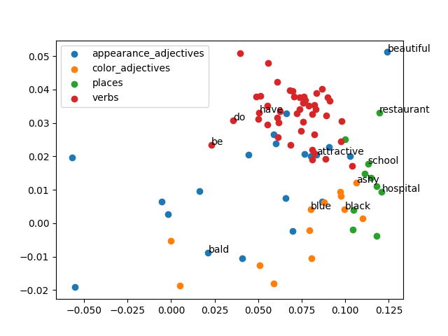
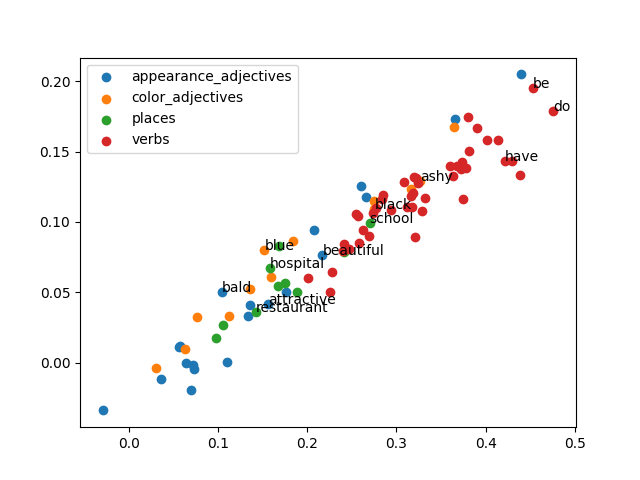

Loading embeddings ...
Running pca ...
# Using Input Embeddings

#### King-Queen test on raw Input Embeddings
* Other distances `[31.10945701599121, 35.842315673828125, 37.41519546508789, 37.09062957763672, 38.12860107421875, 27.20391845703125]`
* king + female - male - queen `41.08931350708008`
#### King-Queen test on PCA n_components=2 of Input Embeddings
* Other distances `[0.01828145734676644, 0.0008760953658059623, 0.03863528574354567, 0.01897605857205255, 0.04485127029836388, 0.03951138110935163]`
* king + female - male - queen `0.045727365664169864`

## Checking similarity of similar words
#### With full Input Embeddings:
* Internal similarity of appearance_adjectives: `{'1-norm': 44.94156558388158, '2-norm': 0.7829586631373355}`
* Internal similarity of color_adjectives: `{'1-norm': 37.93006623096955, '2-norm': 0.5663179739927634}`
* Internal similarity of places: `{'1-norm': 35.624522569444444, '2-norm': 0.4891493055555556}`
* Internal similarity of verbs: `{'1-norm': 31.313117319635307, '2-norm': 0.37932262460978794}`
#### With PCA Input Embeddings n_components=2:
* Internal similarity of appearance_adjectives: `{'1-norm': 0.07301448203692523, '2-norm': 0.005309649463227821}`
* Internal similarity of color_adjectives: `{'1-norm': 0.0513440963968219, '2-norm': 0.0027859564230680346}`
* Internal similarity of places: `{'1-norm': 0.022053178252987988, '2-norm': 0.00036563105967807536}`
* Internal similarity of verbs: `{'1-norm': 0.02769401327709857, '2-norm': 0.0007034715361845313}`
## Checking similarity between word categories
#### With full Input Embeddings:
* Between appearance_adjectives and color_adjectives: `{'1-norm': 42.87520658052885, '2-norm': 0.7133669926570012}`
* Between appearance_adjectives and places: `{'1-norm': 41.886044921875, '2-norm': 0.6782406616210938}`
* Between appearance_adjectives and verbs: `{'1-norm': 39.748295454545456, '2-norm': 0.613283261385831}`
* Between color_adjectives and appearance_adjectives: `{'1-norm': 42.87522160456731, '2-norm': 0.7133669339693509}`
* Between color_adjectives and places: `{'1-norm': 38.65026292067308, '2-norm': 0.5791615999661959}`
* Between color_adjectives and verbs: `{'1-norm': 36.79572429523601, '2-norm': 0.525635619263549}`
* Between places and appearance_adjectives: `{'1-norm': 41.886044921875, '2-norm': 0.6782405090332031}`
* Between places and color_adjectives: `{'1-norm': 38.65026667668269, '2-norm': 0.5791615412785457}`
* Between places and verbs: `{'1-norm': 35.16339666193182, '2-norm': 0.4769976182417436}`
* Between verbs and appearance_adjectives: `{'1-norm': 39.74833540482955, '2-norm': 0.6132830533114346}`
* Between verbs and color_adjectives: `{'1-norm': 36.79573112434441, '2-norm': 0.5256355659111397}`
* Between verbs and places: `{'1-norm': 35.16338334517045, '2-norm': 0.47699779163707384}`
#### With PCA Input Embeddings n_components=2:
* Between appearance_adjectives and color_adjectives: `{'1-norm': 0.06890316430443151, '2-norm': 0.004657220696640347}`
* Between appearance_adjectives and places: `{'1-norm': 0.08074019186429428, '2-norm': 0.006782052188488188}`
* Between appearance_adjectives and verbs: `{'1-norm': 0.06225212146716849, '2-norm': 0.003745950733515957}`
* Between color_adjectives and appearance_adjectives: `{'1-norm': 0.06890316430443151, '2-norm': 0.004657220696640349}`
* Between color_adjectives and places: `{'1-norm': 0.055977492878881985, '2-norm': 0.0031748837837219995}`
* Between color_adjectives and verbs: `{'1-norm': 0.06477787607473731, '2-norm': 0.0028144972888361356}`
* Between places and appearance_adjectives: `{'1-norm': 0.08074019186429426, '2-norm': 0.006782052188488188}`
* Between places and color_adjectives: `{'1-norm': 0.055977492878881985, '2-norm': 0.0031748837837219995}`
* Between places and verbs: `{'1-norm': 0.06249626857167285, '2-norm': 0.0026328277748278077}`
* Between verbs and appearance_adjectives: `{'1-norm': 0.062252121467168485, '2-norm': 0.003745950733515957}`
* Between verbs and color_adjectives: `{'1-norm': 0.06477787607473733, '2-norm': 0.0028144972888361356}`
* Between verbs and places: `{'1-norm': 0.06249626857167285, '2-norm': 0.0026328277748278077}`

Running pca ...
# Using Output Embeddings

#### King-Queen test on raw Output Embeddings
* Other distances `[44.20269775390625, 60.30489730834961, 58.57754135131836, 59.673095703125, 55.21709442138672, 36.70705795288086]`
* king + female - male - queen `53.995574951171875`
#### King-Queen test on PCA n_components=2 of Output Embeddings
* Other distances `[0.13773375877420058, 0.07390561450150751, 0.02065102744933503, 0.2116393732757081, 0.14082460010381376, 0.0708147731718943]`
* king + female - male - queen `0.06691898560230626`

## Checking similarity of similar words
#### With full Output Embeddings:
* Internal similarity of appearance_adjectives: `{'1-norm': 54.93254523026316, '2-norm': 1.1756817466334293}`
* Internal similarity of color_adjectives: `{'1-norm': 52.488343850160255, '2-norm': 1.0657869974772136}`
* Internal similarity of places: `{'1-norm': 54.09551323784722, '2-norm': 1.1317259046766492}`
* Internal similarity of verbs: `{'1-norm': 51.78126651691332, '2-norm': 1.0367430995433073}`
#### With PCA Output Embeddings n_components=2:
* Internal similarity of appearance_adjectives: `{'1-norm': 0.20181911096523683, '2-norm': 0.035648397649397326}`
* Internal similarity of color_adjectives: `{'1-norm': 0.1909932976199452, '2-norm': 0.02942587081659352}`
* Internal similarity of places: `{'1-norm': 0.09284327035082468, '2-norm': 0.007046400099289784}`
* Internal similarity of verbs: `{'1-norm': 0.1138796620101027, '2-norm': 0.011135324759049893}`
## Checking similarity between word categories
#### With full Output Embeddings:
* Between appearance_adjectives and color_adjectives: `{'1-norm': 55.82651742788462, '2-norm': 1.204245347243089}`
* Between appearance_adjectives and places: `{'1-norm': 56.5056884765625, '2-norm': 1.2322281646728515}`
* Between appearance_adjectives and verbs: `{'1-norm': 55.86249112215909, '2-norm': 1.208389698375355}`
* Between color_adjectives and appearance_adjectives: `{'1-norm': 55.82650615985577, '2-norm': 1.2042456993689903}`
* Between color_adjectives and places: `{'1-norm': 55.90807917668269, '2-norm': 1.2059983473557692}`
* Between color_adjectives and verbs: `{'1-norm': 55.27040879042832, '2-norm': 1.1766346751393137}`
* Between places and appearance_adjectives: `{'1-norm': 56.50568359375, '2-norm': 1.2322281646728515}`
* Between places and color_adjectives: `{'1-norm': 55.90807542067308, '2-norm': 1.2059982299804688}`
* Between places and verbs: `{'1-norm': 55.90573064630682, '2-norm': 1.2037384033203125}`
* Between verbs and appearance_adjectives: `{'1-norm': 55.862477805397724, '2-norm': 1.2083899758078835}`
* Between verbs and color_adjectives: `{'1-norm': 55.27038488854895, '2-norm': 1.176634888548951}`
* Between verbs and places: `{'1-norm': 55.90571732954545, '2-norm': 1.2037381258877842}`
#### With PCA Output Embeddings n_components=2:
* Between appearance_adjectives and color_adjectives: `{'1-norm': 0.19958681303714895, '2-norm': 0.0330474152893551}`
* Between appearance_adjectives and places: `{'1-norm': 0.15928972718594556, '2-norm': 0.020704011774438855}`
* Between appearance_adjectives and verbs: `{'1-norm': 0.28549017452700004, '2-norm': 0.059519806462284136}`
* Between color_adjectives and appearance_adjectives: `{'1-norm': 0.19958681303714895, '2-norm': 0.0330474152893551}`
* Between color_adjectives and places: `{'1-norm': 0.14645930926630066, '2-norm': 0.017485128988304875}`
* Between color_adjectives and verbs: `{'1-norm': 0.21423893889142687, '2-norm': 0.03975151466837893}`
* Between places and appearance_adjectives: `{'1-norm': 0.15928972718594556, '2-norm': 0.020704011774438855}`
* Between places and color_adjectives: `{'1-norm': 0.14645930926630066, '2-norm': 0.017485128988304875}`
* Between places and verbs: `{'1-norm': 0.22275983182797177, '2-norm': 0.03691590453565634}`
* Between verbs and appearance_adjectives: `{'1-norm': 0.28549017452700004, '2-norm': 0.05951980646228414}`
* Between verbs and color_adjectives: `{'1-norm': 0.21423893889142687, '2-norm': 0.03975151466837894}`
* Between verbs and places: `{'1-norm': 0.22275983182797177, '2-norm': 0.036915904535656345}`

